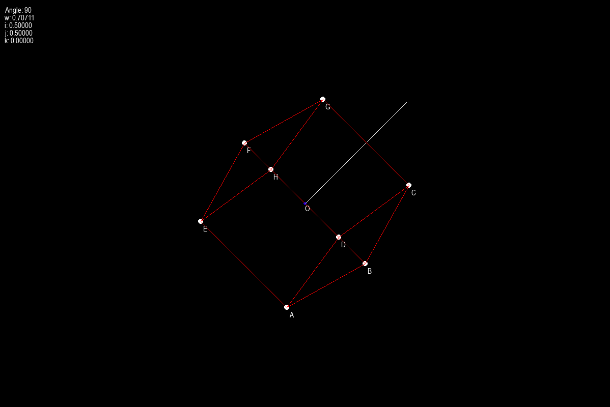

# 3D Rotation with quaternion

Well, I read some articles and books on utilizing quaternion for 3D rotation with computer graphics. So far, a little improvement. That being said, I kind of went in blind with this one. Code is out of place and sloppy. Plus the optimazation part is pretty much not there. In one word, it's TERRIBLE. I will update in place if things get improved in the future if I even get the time for it. 

## How is it?

    * Used Pygame for rendering the cube and a bit of main math library methods.
    * Instead of rotating the cube in just one go with rotation quaternion, I tried moving the cube in real time by generating frames each second as the angle value gets incremented. 
    * Main equation used in it was QVQ'. Q(Rotation quaternion), V(Axis of rotation), Q'(Quaternion conjugate/Inverse of Q)
    * Projects the cube with perspective projection, so it's a bit hard to tell the "z" value since the axis of rotation has a line of indicator. But believe me, it kind of makes sense.
    * Added some text to make sense of whether the imaginary values change or not.
    * Just ignore the slerp.py file. I thought about slerping between the values to get smoother rotation but I made a dumb mistake. Just ignore that part until get on with it. Thanks.

## Looks like this

